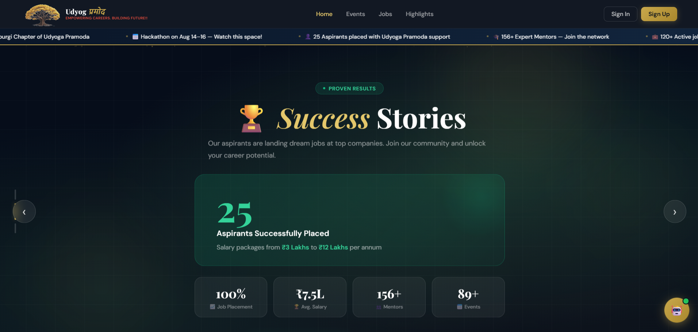
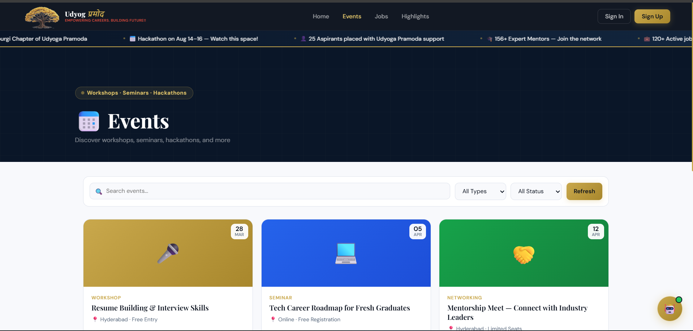
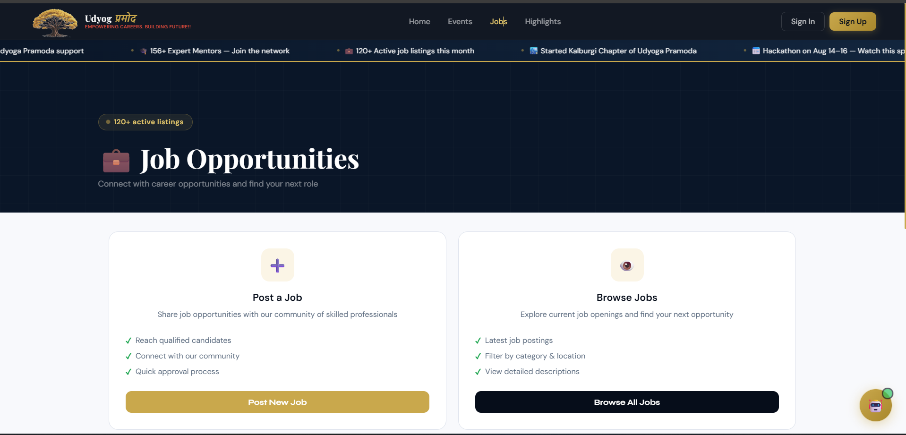
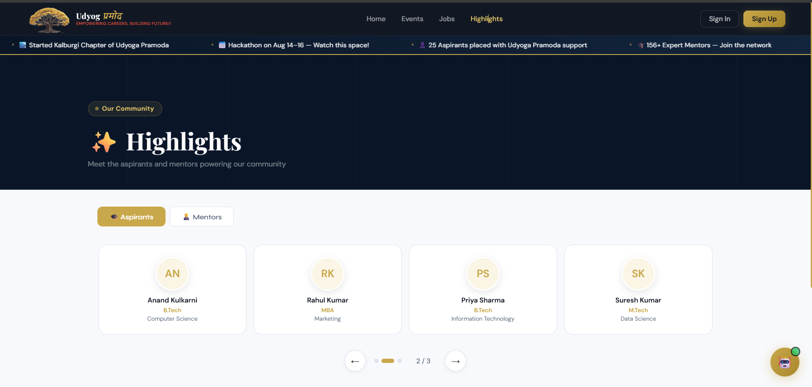
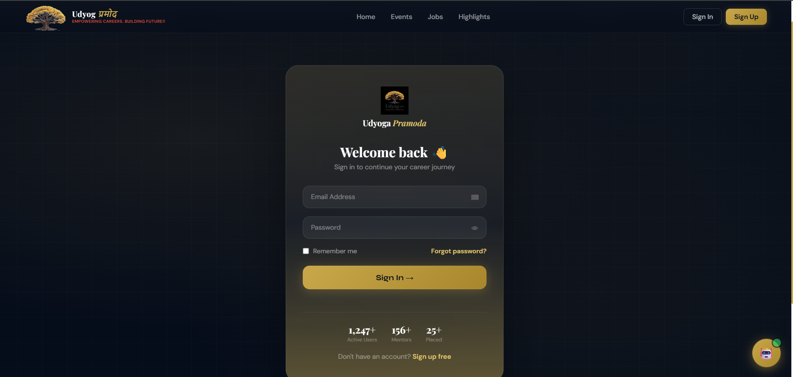
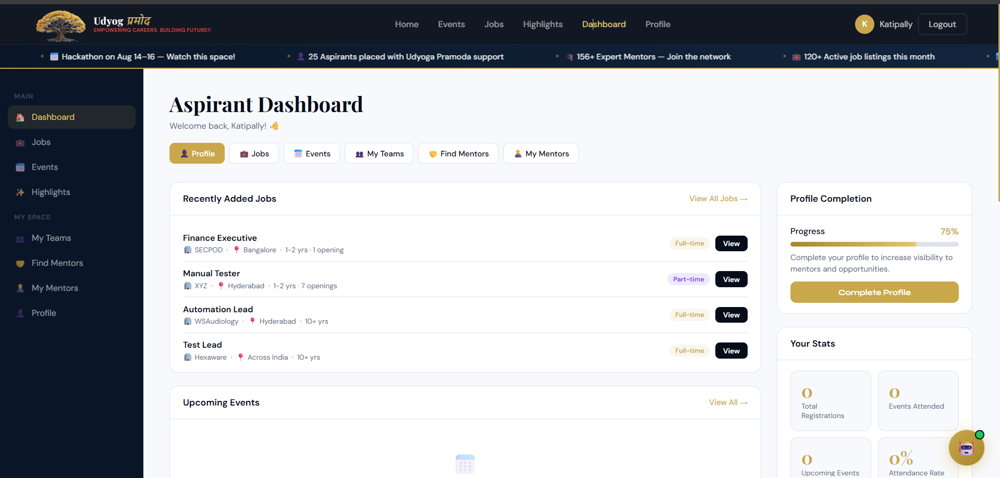
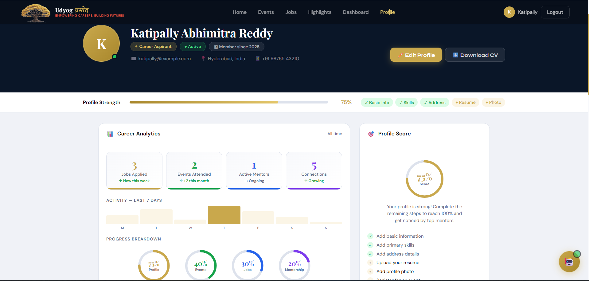

# 🌳 Udyoga Pramoda – Career Platform

> **Empowering Careers. Building Futures.**

A modern, responsive web application designed to connect aspirants, mentors, and recruiters on a single platform. The project provides job listings, career events, mentorship opportunities, community highlights, and a personalized dashboard to help users manage their career journey.

---

# 📖 Overview

Udyoga Pramoda was built to provide students and job seekers with a centralized platform where they can discover job opportunities, attend career events, connect with mentors, and track their professional growth.

The focus of this project was to create a clean, modern, and responsive user interface while maintaining a smooth user experience across different devices.

This project demonstrates my frontend development skills, UI/UX design abilities, and problem-solving approach in building a real-world web application.

---

# 🎯 Problem Statement

Many career-related websites provide only job listings and lack a complete ecosystem where aspirants can:

- Discover career opportunities
- Register for workshops and seminars
- Connect with mentors
- Track career progress
- Manage their profile
- Access everything from a single dashboard

This project addresses these challenges by providing an integrated platform with a modern and user-friendly interface.

---

# 🚀 Features

- Responsive Landing Page
- Modern Navigation Bar
- User Authentication (Sign In / Sign Up)
- Job Opportunities Section
- Career Events & Workshops
- Community Highlights
- Success Stories
- Aspirant Dashboard
- Profile Management
- Career Analytics Dashboard
- Job Search Interface
- Interactive Cards
- Smooth Animations
- Professional UI/UX
- Mobile-Friendly Design

---

# 🛠 Technologies Used

- HTML5
- CSS3
- JavaScript
- Google Fonts
- Git
- GitHub

---

# 💡 Challenges Faced

## Responsive Design

Ensuring every page worked seamlessly across desktop, tablet, and mobile devices required careful use of Flexbox, CSS Grid, and media queries.

---

## UI Consistency

Maintaining consistent spacing, typography, colors, and reusable components across multiple pages was one of the biggest design challenges.

---

## Interactive Components

Developing navigation menus, cards, buttons, and hover effects while maintaining a smooth user experience required several design iterations.

---

## Layout Management

Designing multiple sections such as Dashboard, Profile, Events, Jobs, and Highlights while keeping the interface visually balanced required careful planning.

---

## Performance Optimization

Optimized layouts and animations to ensure smooth rendering without affecting page responsiveness.

---

# ✅ Problems Solved

This project provides:

- A centralized career platform
- Organized job listings
- Career event management
- Personalized dashboard
- User profile management
- Community highlights
- Modern authentication interface
- Responsive design across devices
- Improved user experience with smooth interactions

---

# 🤖 AI Assistance

AI tools were used as development assistants during this project to improve productivity and learn modern development practices.

AI was used for:

- UI brainstorming
- Debugging issues
- CSS optimization
- JavaScript improvements
- Learning best practices
- Code refactoring
- Performance suggestions

All code was reviewed, customized, integrated, tested, and modified by me according to the project requirements.

---

# 📷 Project Screenshots

## 🏠 Home Page

Modern landing page introducing the platform with responsive navigation and career highlights.



---

## 📅 Events

Browse workshops, seminars, networking events, and hackathons with search and filtering functionality.



---

## 💼 Job Opportunities

Explore available jobs or post new opportunities through a clean and intuitive interface.



---

## ⭐ Community Highlights

Displays aspirants, mentors, achievements, and success stories within the platform.



---

## 🔐 User Authentication

Responsive sign-in page designed for secure user access.



---

## 📊 Aspirant Dashboard

Personal dashboard providing quick access to jobs, events, mentors, profile completion, and career statistics.



---

## 👤 User Profile

Profile page with career analytics, profile strength, progress tracking, and resume management.



---

# 📂 Project Structure

```
Udyoga-Pramoda/
│
├── index.html
├── README.md
│
└── screenshots/
    ├── 01-logo.png
    ├── 02-home-page.png
    ├── 03-events-page.png
    ├── 04-jobs-page.png
    ├── 05-highlights-page.png
    ├── 06-signin-page.png
    ├── 07-dashboard.png
    └── 08-profile-page.png
```

---

# 🌱 Future Improvements

- Backend Integration
- User Authentication System
- Database Connectivity
- Resume Upload
- Job Applications
- Employer Dashboard
- Mentor Booking System
- Notifications
- Email Verification
- Admin Panel
- Dark Mode

---

# 📈 What I Learned

Through this project I improved my understanding of:

- Responsive Web Design
- CSS Flexbox & Grid
- JavaScript DOM Manipulation
- UI/UX Design Principles
- Reusable Components
- Project Organization
- Git & GitHub Workflow
- Debugging Techniques
- Performance Optimization
- Building Real-World User Interfaces

---

# ## 🌐 Live Demo

🔗 **Live Website:** https://clever-genie-98e788.netlify.app

---

# 👨‍💻 Author

**Your Name**

- GitHub: https://github.com/kabhimitrain
- LinkedIn: https://www.linkedin.com/in/katipally-abhimitra-reddy-8bab142b9/

---

# 📄 License

This project is intended for educational and portfolio purposes.

---

⭐ If you found this project interesting, feel free to star the repository!

This project is created for educational and portfolio purposes.
